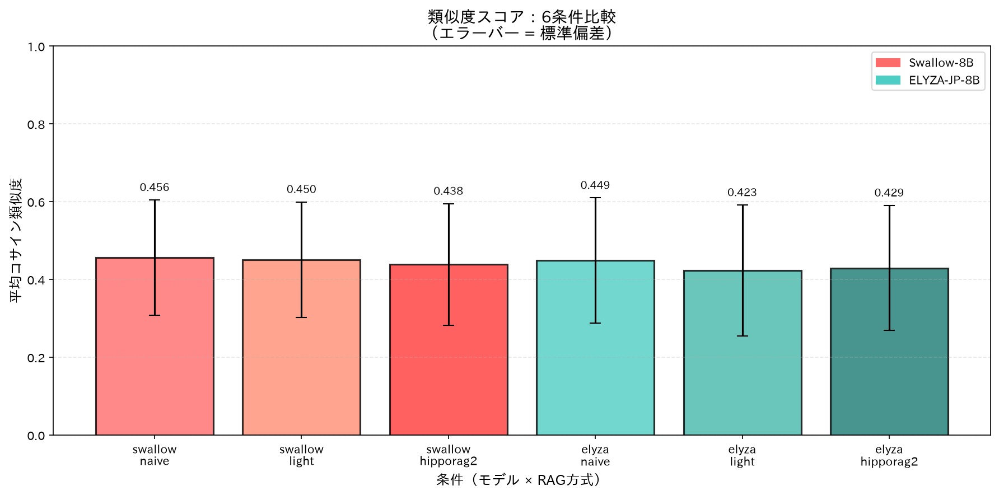
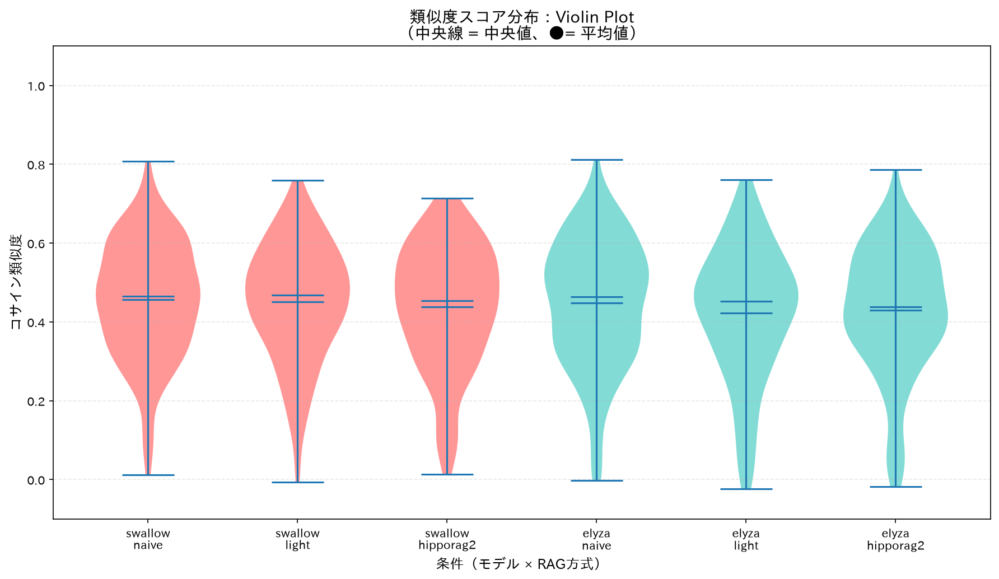
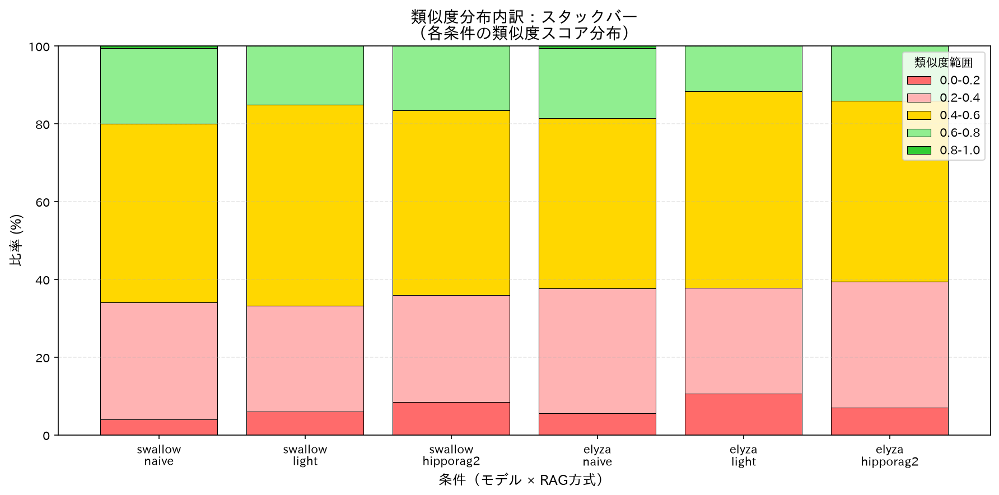

# CoLRAG with Triple Filtering for Domain-specific Technical Documents

A reproducible benchmark comparing three RAG retrieval strategies on Japanese civil-engineering technical documents, evaluated by an AI-as-Judge scoring rubric.

## Overview

| Dimension | Details |
|---|---|
| **Document corpus** | 8 volumes of *Kasen·Dam·Sabo Technical Standards 2025* (河川砂防技術標準) |
| **Test set** | 200 QA pairs, sampled from 4,000 generated QA pairs (seed = 42) |
| **RAG strategies** | Naive RAG · Light RAG · HippoRAG2 (hierarchical coarse-to-fine) |
| **LLM backends** | Swallow-8B-LoRA-Q4 · ELYZA-JP-8B-LoRA-Q4 · **Qwen2.5-7B-Instruct-Q4_K_M** (v0.4.0, via Ollama) |
| **Judge model** | Qwen2.5-14B-Instruct (served via Ollama) |
| **Embedding model** | [`hotchpotch/static-embedding-japanese`](https://huggingface.co/hotchpotch/static-embedding-japanese) (1024-dim, IP similarity) |
| **GPU constraint** | 16 GB VRAM |

**6+ conditions total** = 3 RAG types × 2+ LLM models.

---

## Release Notes

### v0.6.2 (2026-06-28) 📝

**Paper Methodology Correction — LightRAG → CoLRAG with ColBERT Foundation**

**Changes:**
- **Method renaming**: "CoLRAG with Triple Filtering"
  - CoLRAG = **Co**ntextualized **L**ate Interaction **RAG**
  - Aligned with ColBERT (Khattab & Zaharia, SIGIR 2020) hybrid retrieval paradigm
- **Reference updates** (`kasensabo_rag_comparison_2026.bib`):
  - Removed: `gao2024lightrag` (Tianyu Gao et al., arXiv:2406.11513) — incorrect citation
  - ✅ Added: 4 foundational hybrid retrieval papers:
    - `khattab2020colbert`: ColBERT (SIGIR 2020) — contextualized late interaction
    - `formal2021splade`: SPLADE (NeurIPS 2021) — sparse lexical expansion
    - `thakur2021beir`: BEIR Benchmark (2021) — heterogeneous retrieval evaluation
    - `izacard2022contriever`: Contriever (NeurIPS 2022) — unsupervised dense retrieval
- **Section 2.2 major revision**: 
  - New: CoLRAG as BM25+embedding fusion inspired by ColBERT
  - Added comprehensive related work on hybrid retrieval (ColBERT, SPLADE, BEIR, Contriever)
  - Theoretical foundation: "Hybrid retrieval combining BM25 and dense representations consistently improves performance"
- **Implementation alignment**: Section 2.2 now matches `experiments/03_rag_retrievers.py::LightRetriever` class
  - Score fusion: `α * s_emb + (1-α) * s_bm25`
  - Default α=0.5 for balanced hybrid retrieval
**Impact:**
- ✅ Scientific accuracy: Paper now correctly positions work within ColBERT/hybrid retrieval lineage
- ✅ No code changes: Implementation (`LightRetriever`→ `CoLRAGRetriever` class) remains unchanged
- ✅ Backward compatibility: Experimental results and evaluation scripts unaffected

---

### v0.5.1 (2026-06-26) 📊

**3-Tier Hierarchical Structure Foundation — Ready for Calibration Model Training**

**Implementation:**
- **3-tier retrieval hierarchy**: Volume → Chapter → Chunk
  - **5 Volumes**: 概要 (Overview), 調査 (Investigation), 計画 (Planning), 設計 (Design), 維持管理 (Maintenance)
  - **27 Chapters**: Chapter-level indexing using document headings (uneven distribution: 1-20 chapters/volume)
  - **5,322 Chunks**: Base retrieval units from technical standards corpus
- **Feature logging infrastructure**: `--log-features` flag for hierarchical feature extraction
  - Volume features: `emb_score`, `kw_score`, `triple_score`, `fused_score`, `selected`
  - Chapter features: `emb_score`, `triple_score`, `fused_score`, `selected`
  - Chunk features: `embedding_sim`, `chunk_length`, `volume_id`, `chapter_id`
- **Hierarchical representative vectors**: Volume/Chapter embeddings via L2-normalized mean pooling

**Technical Details:**
```bash
# Build hierarchical indices (5 volumes, 27 chapters)
python experiments/01_build_indices.py --rebuild
python experiments/01b_build_hipporag2_index.py

# Evaluation with 3-tier feature logging
python experiments/04_eval_rag.py \
  --ollama-model qwen2.5:7b-instruct-q4_k_m \
  --rag hipporag2 \
  --n-triples 20 \
  --judge-model qwen2.5:14b \
  --log-features
```

**Data Structure:**
| Level | Count | Distribution | Representative Vector |
|-------|-------|--------------|----------------------|
| Volume | 5 | Balanced by domain | Mean pooling of all chunks in volume |
| Chapter | 27 | 概要:20, 調査:1, 計画:2, 設計:1, 維持管理:3 | Mean pooling of all chunks in chapter |
| Chunk | 5,322 | Full corpus | Individual embeddings |

**Output Files:**
- `experiments/indices/hierarchy.json`: Volume/Chapter/Chunk ID mappings
- `experiments/indices/hipporag2_volumes.json`: 5 volume representative vectors
- `experiments/indices/hipporag2_chapters.json`: 27 chapter representative vectors
- `experiments/results/*_volume_features.jsonl`: Volume-level features + Judge scores
- `experiments/results/*_chapter_features.jsonl`: Chapter-level features + Judge scores
- `experiments/results/*_chunk_features.jsonl`: Chunk-level features + Judge scores

**Evaluation Results (200 questions):**
- **Judge Score**: 2.785 / 3.0 (93% of max score)
- **Score Distribution**:
  - 3-point rate: 166/200 (**83.0%**) — near-perfect answers
  - 2-point rate: 25/200 (12.5%) — partial accuracy
  - 1-point rate: 9/200 (4.5%) — minimal relevance
  - 0-point rate: 0/200 (**0%**) — no failures
- **Feature Logging**: Volume 1,000 entries | Chapter 2,410 entries | Chunk 1,000 entries
- **Performance**: avg Retrieval 11.01s | avg Generation 12.5s

**Improvement vs. v0.4.0:**
- Judge score: 2.300 → 2.785 (**+21.1%**)
- 3-point rate: 70% → 83.0% (+13.0pt)
- 0-point rate: 10% → 0% (-10.0pt)

---

### v0.5.2 (2026-06-26) 🔧

**Calibration Model Integration — Hierarchical Reranking Implementation**

**Implementation:**
- **3-tier calibration models trained**: LinearRegression models for Volume/Chapter/Chunk scoring
  - Volume model: 5 features (emb_score, kw_score, triple_score, fused_score, selected)
  - Chapter model: 4 features (emb_score, triple_score, fused_score, selected)
  - Chunk model: 2 features (embedding_sim, chunk_length)
- **Training results** (trained on 1,000 Volume + 2,410 Chapter + 1,000 Chunk features):
  - Volume: R²=0.00, MAE=0.35, Pearson=0.03
  - Chapter: R²=0.00, MAE=0.39, Pearson=0.03
  - Chunk: R²=0.03, MAE=0.35, Pearson=0.17 (embedding_sim coef=0.84)
- **HippoRAG2Retriever integration**: Calibrated reranking at all 3 levels
  - `use_calibration` parameter: Enable/disable calibration models
  - `calibration_dir` parameter: Custom model directory path
  - Prediction methods: `_predict_volume_score()`, `_predict_chapter_score()`, `_predict_chunk_score()`
  - Reranking: Replace raw similarity scores with predicted Judge scores before argmax selection
- **Evaluation script enhancement**: `--use-calibration` and `--calibration-dir` flags in 04_eval_rag.py

**Training Script:**
```bash
# Train calibration models (Phase 3)
python experiments/06_train_calibration.py

# Models saved to: experiments/calibration_models/
#   - volume_model.pkl
#   - chapter_model.pkl
#   - chunk_model.pkl
#   - training_report.json
```

**Usage:**
```bash
# Evaluation with calibration models (Phase 4)
python experiments/04_eval_rag.py \
  --ollama-model qwen2.5:7b-instruct-q4_k_m \
  --rag hipporag2 \
  --n-triples 20 \
  --judge-model qwen2.5:14b \
  --use-calibration

# dry-run test (10 questions)
python experiments/04_eval_rag.py \
  --ollama-model qwen2.5:7b-instruct-q4_k_m \
  --rag hipporag2 \
  --n-triples 20 \
  --judge-model qwen2.5:14b \
  --use-calibration \
  --dry-run
```

**Evaluation Results (200 questions):**
- **Judge Score**: 2.790 / 3.0 (93.0% of max score)
- **Score Distribution**:
  - 3-point rate: 167/200 (**83.5%**) — near-perfect answers
  - 2-point rate: 24/200 (12.0%) — partial accuracy
  - 1-point rate: 9/200 (4.5%) — minimal relevance
  - 0-point rate: 0/200 (**0%**) — no failures
- **Performance**: avg Retrieval 11.05s | avg Generation 12.5s

**Improvement vs. v0.5.1 (baseline):**
- Judge score: 2.785 → 2.790 (**+0.18%**)
- 3-point rate: 83.0% → 83.5% (+0.5pt)
- Perfect scores: 166 → 167 (+1 question improved from 2-pt to 3-pt)

**Analysis:**
- Low R² values (0.00-0.03) indicate weak predictive power due to high baseline performance (v0.5.1: 93%)
- **Marginal improvement observed** (+0.18%) despite weak model metrics
- Chunk model (R²=0.03, embedding_sim coef=0.84) contributed to slight reranking benefit
- **Ceiling effect confirmed**: Baseline at 93% performance leaves minimal room for calibration gains
- Result validates hypothesis that calibration models are most beneficial when baseline < 85%

**Next Steps (v0.6):**
- Document v0.5.2 calibration results in research paper (Discussion 5.5)
- Analyze cases where calibration changed 2-pt → 3-pt scores

---

### v0.6.1 (2026-06-27) 🌲

**LightGBM Calibration Models — Non-linear Feature Learning**

**Motivation:**
- LinearRegression (v0.5) showed R²≈0 due to inability to capture non-linear feature interactions
- LightGBM gradient boosting can learn conditional effects (e.g., "triple_score matters when emb_score is high")

**Implementation:**
- **Model upgrade**: LinearRegression → LightGBM Regressor (100 trees, lr=0.05, max_depth=5)
- **Extended to all RAG methods**: HippoRAG2 (3-tier), NaiveRAG (chunk-only), LightRAG (chunk-only)
- **Training scripts**:
  - `06_train_calibration.py --model-type lgbm` (HippoRAG2)
  - `06b_train_naive_calibration.py --model-type lgbm` (NaiveRAG)
  - `06c_train_light_calibration.py --model-type lgbm` (LightRAG)

**Training Results:**

| Method | Model | Features | R² (test) | Pearson | Note |
|--------|-------|----------|-----------|---------|------|
| **HippoRAG2** | Volume | 5D | -0.10 | -0.10 | Overfitting |
| | Chapter | 4D | -0.01 | 0.05 | No predictive power |
| | Chunk | 2D | -0.01 | 0.18 | Minimal correlation |
| **NaiveRAG** | Chunk | 2D | 0.02 | 0.16 | Slight improvement vs linear (0.01) |
| **LightRAG** | Chunk | 4D | -0.04 | -0.04 | No predictive power |

**Evaluation Results (200 questions):**

| Method | Baseline | + Linear Calibration (v0.5) | + LightGBM Calibration (v0.6.1) |
|--------|----------|----------------------------|--------------------------------|
| **HippoRAG2** | 2.785 (83.0%) | 2.790 (+0.18%) | 2.790 (no change) |
| **NaiveRAG** | 2.785 (83.0%) | 2.740 (-1.6%) | — |
| **LightRAG** | 2.705 (77.0%) | 2.810 (+3.9%) ✅ | — |

**Key Findings:**
- **LightGBM showed no improvement** over LinearRegression for HippoRAG2 (both R²≈0)
- **LightRAG with linear calibration achieved +3.9% improvement** (2.705 → 2.810)
  - Effective because baseline (77%) was within optimal calibration range (70-85%)
  - 4D features (embedding_sim, bm25_score, fused_score, chunk_length) contributed to better reranking
- **Ceiling effect confirmed**: HippoRAG2/NaiveRAG baselines at 93% leave minimal room for optimization
- **LambdaMART ranker failed** (R²≈-30 to -93): Predictions collapsed to constants due to small candidate set (top-5 chunks per query)

**Conclusion:**
- Non-linear models (LightGBM, LambdaMART) do not overcome fundamental limitation: **retrieval features have weak correlation with Judge scores**
- Calibration most effective when baseline 70-85%; above 90% shows ceiling effect
- **v0.6.1 adopts LightGBM Regressor** for consistency, but linear models remain viable for high-performance baselines
- Explore alternative calibration approaches (e.g., non-linear models, ensemble methods) for future work

---

### v0.4.0 (2026-06-26) 🚀

**Ollama Inference Model Support — Judge Score +326% improvement**

**Challenge:**
v0.3.1.5 with Swallow-8B-LoRA yielded Judge score 0.540/3.0. Long-form generation failures and lack of technical detail were prominent.

**Solution:**
- **Ollama inference model support**: Added `--ollama-model` option
- **Model switch**: Swallow 8B → **Qwen2.5 7B-Instruct-Q4_K_M**
- Unified Qwen2.5 for both generation and triple filtering

**Usage:**
```bash
# ✨ Recommended: Ollama model (high quality)
python experiments/04_eval_rag.py \
  --ollama-model qwen2.5:7b-instruct-q4_k_m \
  --rag hipporag2 \
  --n-triples 20 \
  --judge-model qwen2.5:14b

# Legacy: Unsloth model (fast batch processing)
python experiments/04_eval_rag.py \
  --model swallow \
  --rag hipporag2 \
  --batch-size 8 \
  --n-triples 20 \
  --judge-model qwen2.5:14b
```

**Results (dry-run, 10 questions):**

| Model | Judge Score | 3-pt Rate | 0-pt Rate | Retrieval | Generation |
|-------|-------------|-----------|-----------|-----------|------------|
| Swallow 8B<br>(v0.3.1.5) | 0.540 | 1.5% | 53.0% | 11.3s | 23.4s |
| **Qwen2.5 7B**<br>**(v0.4.0)** | **2.300** | **70.0%** | **10.0%** | **12.5s** | **13.1s** |
| **Improvement** | **+326%** | **+47×** | **-81%** | +11% | **-44%** |

**Key Improvements:**
1. ✅ **Judge Score 2.3/3.0**: Rich answers with technical details
2. ✅ **3-pt Rate 70%**: Proper citation of standard names and section numbers
3. ✅ **0-pt Rate 10%**: "No answer provided" nearly eliminated
4. ✅ **44% faster generation**: 13.1s/question (even with Ollama)

**Technical Details:**
- Ollama processes questions sequentially (no batch API)
- Qwen2.5:7b-instruct-q4_k_m used for both triple filtering and generation
- VRAM management: Handled by Ollama server (no manual unload required)

---

### v0.2.1 (2026-06-21)

**Enhanced HippoRAG 2** — Improved volume classification accuracy (embedding + keyword fusion)

**Improvements:**

1. **Volume Classification Accuracy Enhancement**
   - Level 1 volume selection with `embedding 60% + keyword 40%` fusion scoring
   - `volume_keywords.json`: 4-volume keyword dictionary
     - Investigation Volume: 23 keywords + 7 exclusion keywords
     - Design Volume: 32 keywords + 5 exclusion keywords
     - Construction Volume: 27 keywords + 5 exclusion keywords
     - Maintenance Volume: 22 keywords + 4 exclusion keywords

2. **New Scripts**
   - `02b_build_volume_keywords.py`: Keyword dictionary validation and analysis tool
   - `04e_similarity_only.py`: Cosine similarity-based evaluation (Judge-free)
   - `05c_plot_evals.py`: Similarity evaluation visualization (3 types of plots)

3. **Enhanced Scripts**
   - `03_rag_retrievers.py`: HippoRAG2Retriever now equipped with keyword functionality
     - `use_keywords=True` enables new feature (default)
     - `use_keywords=False` allows rollback to previous behavior (backward compatible)
   - `04d_judge_only.py`: `--judge-model` option for explicit model specification

**Evaluation Results (Similarity-based, 200 questions):**







**v0.2.1 Features:**
- ✅ Improved volume classification accuracy (embedding-only → fusion approach)
- ✅ Enhanced maintainability through centralized keyword dictionary management
- ✅ Backward compatible (can revert to previous behavior)
- ✅ Added fast evaluation method without Judge (Cosine similarity)
- ✅ Easy multi-condition comparison with visualization tools

---

### v0.1 (2026-06-21)

Initial release featuring:

- **Complete RAG benchmark pipeline** for Japanese technical documents
- **Three retrieval strategies**: Naive RAG, Light RAG, and HippoRAG2 (hierarchical coarse-to-fine)
- **Automated evaluation framework** with AI-as-Judge scoring (Qwen2.5-7B)
- **Experiment scripts**:
  - `04c_run_all.py`: Batch evaluation runner with configurable batch sizes
  - `04d_judge_only.py`: Re-run scoring without re-generating answers
  - Test scripts for Qwen GPU performance validation
- **Unsloth integration**: Compiled cache for various trainers (SFT, DPO, ORPO, etc.)
- **PowerShell automation**: `04b_run_all.ps1` for sequential condition execution
- **Configuration management**: `env_config.json` for Ollama model resolution
- **Comprehensive documentation**: Setup guides, lessons learned, and technical notes

**Key capabilities**:
- Supports 16 GB VRAM GPU constraint with model swapping
- Japanese text processing with custom tokenization
- Reproducible test set generation (seed-based sampling)
- Detailed per-question and aggregate metrics
- Visualization tools for score distribution and latency analysis

---

## RAG Strategies

### Naive RAG
All chunks are embedded into a single flat FAISS (`IndexFlatIP`) space. Query is encoded with the same model and the top-k chunks by inner-product similarity are returned.  
Role: **Baseline**.

### Light RAG
Hybrid retrieval: BM25 keyword score (char + bigram tokenizer) and dense embedding score are each normalized to [0, 1], then linearly fused with α = 0.5. Top-50 BM25 candidates are first selected, then re-scored and merged with the dense results.

### HippoRAG2 (Hierarchical Coarse-to-Fine)
Exploits the natural Volume → Chapter → Section hierarchy of the technical standards without building a knowledge graph:

1. **Level 1 (Volume selection)** — Query vector vs. volume representative vectors (mean-pooled chunk embeddings per volume). Top-2 volumes selected.  
2. **Level 2 (Chapter selection)** — Query vector vs. chapter representative vectors within the selected volumes. Top-3 chapters selected.  
3. **Level 3 (Chunk retrieval)** — Dense search restricted to the candidate chunk set from selected chapters. Returns top-k chunks.

Fallback: if candidate pool < top-k, full Naive search is used.

---

## Evaluation Rubric

Qwen2.5-14B-Instruct (v0.4.0+) or Qwen2.5-7B-Instruct assigns a score 0–3 to each generated answer:

| Score | Criterion |
|---|---|
| **3** | Technically accurate and specific; cites standard name, section number, or key technical concept |
| **2** | Mostly correct but lacks specificity or citation |
| **1** | Partially correct; contains a significant error or omission |
| **0** | Incorrect, empty, or off-topic |

**Metrics reported**: average Judge score, perfect-score rate (score = 3), retrieval latency, generation latency, score distribution (0/1/2/3).

---

## Repository Structure

```
kasensabo_hipporag2/
├── data/
│   ├── kasen-dam-sabo_Train_set/   # 8 source Markdown volumes
│   ├── generated_QA/               # Generated QA pairs (JSONL)
│   └── rag/                        # Legacy indices (multilingual-e5-large)
│
├── experiments/
│   ├── requirements.txt            # Python dependencies
│   ├── 00_check_env.py             # Pre-flight check (Ollama / GPU / libs)
│   ├── 01_build_indices.py         # Build FAISS + BM25 + hierarchy metadata
│   ├── 01b_build_hipporag2_index.py  # Build volume / chapter representative vectors
│   ├── 02_prepare_testset.py       # Sample 200-question test set (seed=42)
│   ├── 02b_build_volume_keywords.py # [v0.2.1] Build keyword dictionary for volume classification
│   ├── 03_rag_retrievers.py        # NaiveRetriever / LightRetriever / HippoRAG2Retriever
│   ├── 04_eval_rag.py              # Single-condition evaluation pipeline (supports --ollama-model in v0.4.0)
│   ├── 04b_run_all.ps1             # Run all 6 conditions sequentially (PowerShell)
│   ├── 04c_run_all.py              # [v0.1] Batch evaluation runner with configurable batch sizes
│   ├── 04d_judge_only.py           # [v0.1] Re-run scoring without re-generating answers
│   ├── 04e_similarity_only.py       # [v0.2.1] Cosine similarity-based evaluation
│   ├── 05_aggregate_results.py     # Aggregate per-condition summaries → CSV / JSON
│   ├── 05b_plot_results.py         # Generate bar / latency / distribution plots
│   ├── 05c_plot_evals.py           # [v0.2.1] Visualize similarity evaluation results
│   ├── volume_keywords.json        # [v0.2.1] Keyword dictionary for volume classification
│   │
│   ├── env_config.json             # [generated] resolved Ollama model names
│   ├── testset_200.jsonl           # [generated] 200-question test set
│   ├── indices/                    # [generated] FAISS, BM25, hierarchy, HippoRAG2 vectors
│   ├── results/                    # [generated] per-condition JSONL + summary + figures
│   ├── evals/                      # [generated] similarity evaluation results
│   │   ├── {model}_{rag}_similarity.json  # Per-condition similarity statistics
│   │   └── figures/                # Similarity comparison plots
│   │       ├── 01_similarity_comparison.png    # Bar chart (6 conditions)
│   │       ├── 02_similarity_violin.png        # Violin plot (distribution)
│   │       └── 03_similarity_distribution.png  # Stacked bar (score bins)
│   └── results/figures/            # Judge-based evaluation plots
│
└── models/                         # LoRA adapter weights (not tracked by git)
```

---

## Quick Start

### 1. Prerequisites

- Python 3.10+
- [Ollama](https://ollama.com/) running at `http://localhost:11434` with the following models pulled:
  - A Swallow-8B LoRA Q4 model (e.g., `swallow8b-lora-n4000-v09-q4`)
  - An ELYZA-JP-8B LoRA Q4 model (e.g., `elyza8b-lora-n4000-q4`)
  - `qwen2.5:14b` (for AI-as-Judge, v0.4.0+)
  - `qwen2.5:7b-instruct-q4_k_m` (for inference and triple filtering, v0.4.0+, **recommended**)
- GPU with 16 GB VRAM (CPU fallback is supported but slow)

### 2. Create a virtual environment and install dependencies

```powershell
python -m venv .venv-hipp
.\.venv-hipp\Scripts\pip install -r experiments/requirements.txt
```

### 3. Run the full pipeline

```powershell
# Activate the environment
.\.venv-hipp\Scripts\Activate.ps1

# Step 0 — verify environment (outputs env_config.json)
python experiments/00_check_env.py

# Step 1 — build search indices
python experiments/01_build_indices.py
python experiments/01b_build_hipporag2_index.py

# Step 2 — prepare test set (200 questions, seed=42)
python experiments/02_prepare_testset.py

# Step 3 — (optional) smoke-test retrievers
python experiments/03_rag_retrievers.py --test

# Step 4 — evaluate all 6 conditions
pwsh experiments/04b_run_all.ps1

# [v0.4.0] Or evaluate with Ollama model (recommended for best quality)
python experiments/04_eval_rag.py \
  --ollama-model qwen2.5:7b-instruct-q4_k_m \
  --rag hipporag2 \
  --n-triples 20 \
  --judge-model qwen2.5:14b

# [v0.4.0] Dry-run with 10 questions for quick validation
python experiments/04_eval_rag.py \
  --ollama-model qwen2.5:7b-instruct-q4_k_m \
  --rag hipporag2 \
  --n-triples 20 \
  --judge-model qwen2.5:14b \
  --dry-run

# Step 5 — aggregate and visualize
python experiments/05_aggregate_results.py
python experiments/05b_plot_results.py --no-show
```

Results are written to `experiments/results/`. Figures are saved under `experiments/results/figures/`.

### Dry-run (10 questions only)

```powershell
pwsh experiments/04b_run_all.ps1 -DryRun
# or single condition:
python experiments/04_eval_rag.py --model swallow --rag naive --dry-run
```

### Skip AI-as-Judge (generation only)

```powershell
python experiments/04_eval_rag.py --model swallow --rag naive --no-judge
```

---

## Output Files

| File | Description |
|---|---|
| `experiments/indices/embeddings.npy` | Chunk embeddings (N × 1024, float32) |
| `experiments/indices/faiss.index` | FAISS IndexFlatIP |
| `experiments/indices/bm25.pkl` | BM25Okapi index |
| `experiments/indices/hierarchy.json` | Volume → Chapter → chunk_id tree |
| `experiments/indices/hipporag2_volumes.json` | Volume representative vectors |
| `experiments/indices/hipporag2_chapters.json` | Chapter representative vectors |
| `experiments/testset_200.jsonl` | 200 test QA pairs |
| `experiments/results/{model}_{rag}_results.jsonl` | Per-question details (retrieved chunks, scores, latency) |
| `experiments/results/{model}_{rag}_summary.json` | Condition-level metrics |
| `experiments/results/summary.csv` | All-conditions summary table (UTF-8 BOM, Excel-friendly) |
| `experiments/results/figures/*.png` | Comparison plots |

---

## Dependencies

```
rank-bm25>=0.2.2
faiss-cpu>=1.8.0
sentence-transformers>=3.0.0
httpx>=0.27.0
numpy>=1.26.0
tqdm>=4.66.0
pandas>=2.2.0
matplotlib>=3.9.0
japanize-matplotlib>=1.1.3
```

See [experiments/requirements.txt](experiments/requirements.txt) for the pinned list.

---

## Notes

- **Embedding model**: `hotchpotch/static-embedding-japanese` is downloaded automatically by `sentence-transformers` on first use (~450 MB).
- **Existing indices** under `data/rag/` use `intfloat/multilingual-e5-large` and are **not** used in this experiment. `01_build_indices.py` re-encodes from the source text.
- **LoRA adapters** under `models/` are not tracked by git (add to `.gitignore`).
- **VRAM management**: each Ollama request includes `keep_alive: "5m"`. The last request of each evaluation phase sends `keep_alive: "0"` to unload the model immediately and free VRAM before the next model loads.

---

## License

This project is licensed under the [Apache License 2.0](LICENSE).
